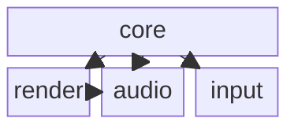

# Code Dependency Skill

## About this document
- **Kind:** skill (reusable capability, auto-loaded by opencode)
- **Read by:** any agent matching its description; **written by:** maintainers
- **Related:** own `code-` domain; pairs loosely with `software-architecture` (library boundaries).

You analyze a codebase's **coarse-grained** dependency structure and summarize it as
a Markdown document containing a [Mermaid block diagram](https://mermaid.ai/open-source/syntax/block.html).

You deliberately STOP at the **package / namespace** level. You do **not** dive into
classes, functions, or individual includes. The output is a dependency map a human can
skim in seconds, not a call graph.

## Scope

This skill **owns**:
- grouping the code into nodes (package/library/namespace),
- resolving directed dependencies *between* those nodes,
- detecting dependency cycles,
- emitting the Markdown + Mermaid block diagram.

This skill **does not**:
- enumerate classes, files, or functions inside a node,
- produce call graphs or control flow,
- refactor or change code — it only reads and reports.

## Nodes and edges (the granularity)

A **node** is one coarse unit. Keep the count small (handful to a few dozen):

| Language | Node = | Edge = |
|---|---|---|
| C++ | a `namespace` or a CMake target/library | one namespace/target `#include`s / links another |
| Python | an importable `package` (directory with `__init__.py`) or top-level module | one package `import`s another |

Do **not** split a node per `.h`/`.cpp` or per `.py` file. Collapse files into their
namespace/package. If a CMake target maps 1:1 to a namespace, treat it as a single node.

## Resolution method (read-only)

Resolve dependencies by **reading and grepping the source**, not by building:

- **C++ namespaces:** grep `namespace\s+(\w+)`; record which namespace's headers are
  `#include`d by files in another namespace. Use CMake `target_link_libraries` as the
  authoritative link-direction signal when present.
- **C++ includes:** map `#include "lib/foo.h"` → the owning namespace/package; collapse
  to namespace→namespace edges. Ignore system/`<...>` includes.
- **Python packages:** find `package/` dirs with `__init__.py` and top-level `.py`
  modules; record `import <pkg>` / `from <pkg> import ...` edges between them. Ignore
  stdlib and third-party (`pip`) imports unless the user wants external edges shown.

Qualify each edge as **internal** (within the repo) or **external** (third-party /
system). Default output shows internal edges only; external edges are summarized in a
short list, not in the diagram, unless asked.

## Output: Markdown + Mermaid block diagram

Emit exactly one fenced ` ```mermaid ` block using `block` syntax. Position each node
explicitly (block diagrams do NOT auto-layout — you place them). Group by layer/column
where it helps readability.

````md
# Code Dependencies: <Project / Subtree>

## Dependency Graph



## Nodes
| Node | Language | Kind | Responsibility |
|---|---|---|---|
| core | C++ | namespace `heph::core` | shared types, math |
| render | C++ | namespace `heph::render` | window + GPU draw |
| audio | C++ | namespace `heph::audio` | playback |
| input | Python | package `heph_input` | device polling |

## Internal Edges
| From | To | Via |
|---|---|---|
| render | core | `#include <heph/core.h>` |
| audio | core | `#include <heph/core.h>` |
| input | core | `import heph.core` |

## Cycles
- None.  (or: `render → audio → render` — flag for review)

## External Dependencies
- `glfw` (C++, linked by render), `numpy` (Python, used by input).
````

### Mermaid `block` notes
- Use `columns N` to set the grid, then place nodes; long labels go in quotes: `A["my pkg"]`.
- Directed edge: `A --> B`. Undirected/related: `A --- B`. Label an edge with `A -- "via X" --> B`.
- Composite/grouping blocks are allowed: `block:id` defines a group; nest nodes inside.
- Do **not** rely on auto-layout — the diagram is only correct if you place nodes.
- Keep node ids ASCII-safe (no spaces/dots in the id; put the pretty name in quotes).

## When to Hand Off
- A flagged cycle or wrong layering → raise with **software-architecture** (library boundaries).
- Per-library interface detail → **software-design**.
- This skill is read-only; any fix lives in a normal ticket/worker flow, not here.
