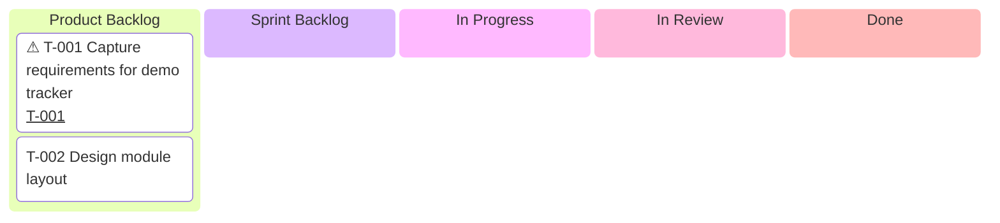
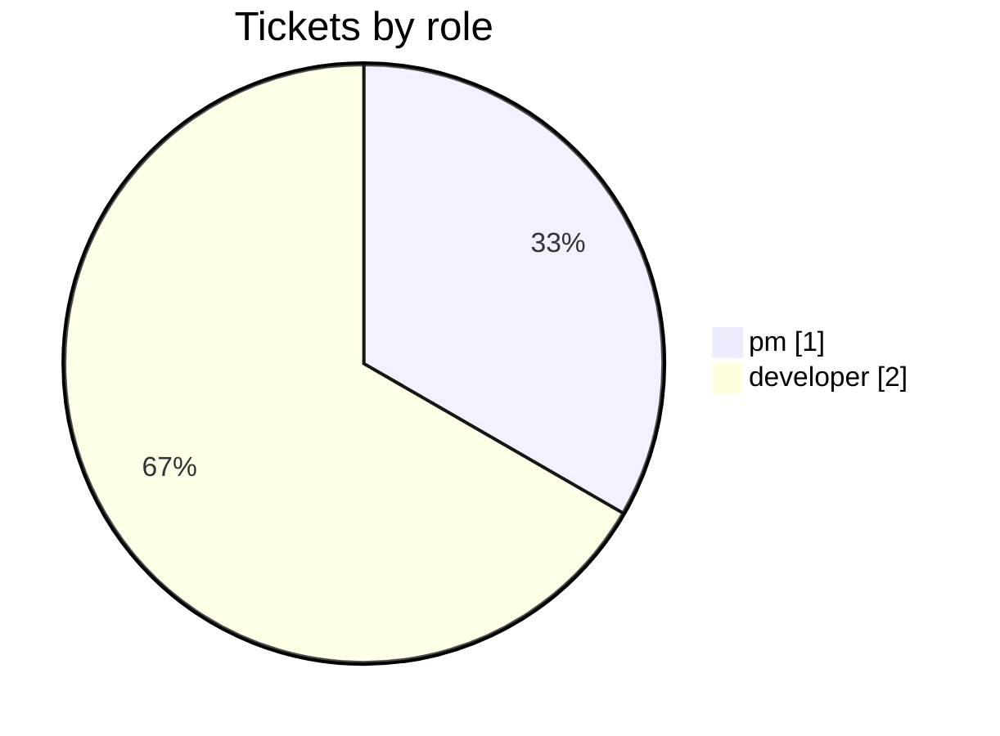
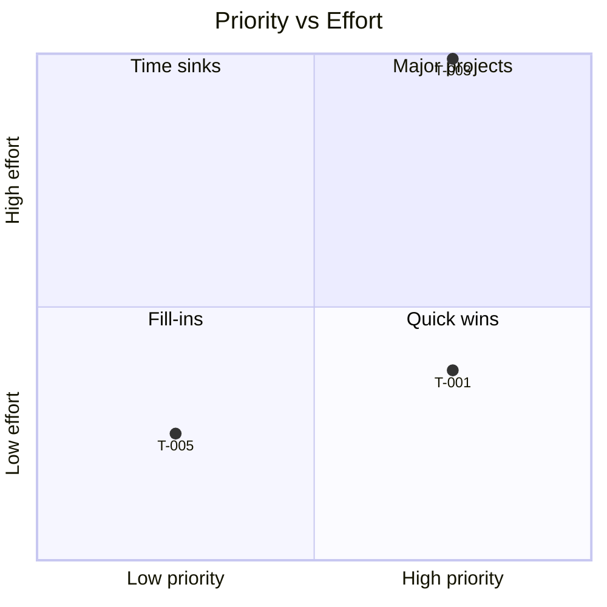

```mermaid
gantt
  title Roadmap (story_points as day proxy)
  dateFormat X
  axisFormat %s
  section Backlog
  T-003 Implement core ticket store :t003, 0, 8d
  T-001 Capture requirements :t001, after t003, 3d
```

# Visualize PM Project Skill

## About this document
- **Kind:** `skill` (reusable capability, auto-loaded by opencode)
- **Read by:** any agent matching its description (notably `pm-reporter`, `pm`); also humans authoring reports; **written by:** maintainers
- **Related:** part of the `pm-*` domain set; standalone (no lifecycle pair). Reads tickets/sprints from the `pm` MCP server. Every file it emits follows `pm-doc-about`.

You take a **pm MCP project** and emit a small, **navigable** set of Markdown
files full of [Mermaid](https://mermaid.js.org/) diagrams. The output is a
human-skimmable, hyperlinked snapshot of where the project's work is — board,
roadmap, analysis, and one page per ticket — **not** a live view. Re-run to refresh.

## Position

Standalone, on-demand `pm-*` utility. No lifecycle pair; mutates no tickets. It
only **reads** ticket/sprint state and **writes** Markdown. Visual-reporting
counterpart to `pm-audit-traceability` (which is textual).

## Scope

This skill **owns**:
- sourcing ticket/sprint data for one project,
- mapping ticket fields onto the supported Mermaid diagram types,
- emitting a fixed, linked file set under an output directory,
- keeping that output idempotent (regeneration overwrites, never duplicates).

This skill **does not**:
- create, update, or move tickets (read-only over the `pm` store),
- render diagrams to PNG/SVG (it emits Mermaid **source**; rendering is the viewer's job),
- decide priorities or points — it only plots what the data says.

## Inputs

Get the data from the `pm` MCP server (preferred), or — ad-hoc without the tools —
read the project's JSON store directly: `mcp/pm/data/<project>.json`.

Tools (all take `project`): `pm_list_tickets` (source of truth for every view),
`pm_get_board`, `pm_get_backlog`, `pm_audit_traceability` (epic `links`).

Ticket fields consumed: `id`, `title`, `status`, `role`, `type`, `priority`,
`story_points`, `sprint`, `epic`, `blocked`, `assignee`, `acceptance_criteria`,
and **`todos`** (the per-ticket checklist; each item `{text, done}` — managed via
`pm_add_todo` / `pm_toggle_todo` / `pm_remove_todo`).

## Field → view mapping

| View | Source fields | Encoding |
|---|---|---|
| **Kanban** (`BOARD.md`) | `status`, `id`, `title`, `blocked` | one column per status; one card per ticket; blocked cards prefixed `⚠`; each card links to its ticket page |
| **Pies** (`BOARD.md`) | `role` / `type` / `priority` | counts; three separate pies |
| **Gantt** (`ROADMAP.md`) | `sprint`, `id`, `title`, `priority`, `story_points` | one section per sprint (unscheduled → `Backlog`); `story_points` as a **day proxy**; ordered by priority desc then points desc. A **Tasks table** sits below it with the clickable ticket links (gantt tasks cannot be linked) |
| **Traceability graph** (`TRACEABILITY.md`) | `epic`, `id` | epic → children; if no epics, a role-grouped fallback. Every ticket node links to its ticket page |
| **Quadrant** (`TRACEABILITY.md`) | `priority`, `story_points` | x = priority (0.25/0.5/0.75/1.0 → clamped); y = points / max(points) → clamped |
| **Per-ticket page** (`tickets/<ID>.md`) | all fields, esp. `todos`, `acceptance_criteria` | metadata table + checkbox todo list (`[ ]`/`[x]`) + AC bullets |

## Output file set

Default directory: `docs/pm/<project>/` in the repo (override per run, e.g. a
sandbox like `C:\Temp\pm-<project>`). Always write exactly:

| File | Contents |
|---|---|
| `INDEX.md` | entry point: counts/totals, `generated_at`, links to the 3 reports + a **Tickets table** linking every per-ticket page |
| `BOARD.md` | kanban (cards link to tickets) + Tickets table + 3 pies |
| `ROADMAP.md` | gantt + Tasks table (clickable ticket links) |
| `TRACEABILITY.md` | epic graph (nodes link to tickets) + quadrant |
| `tickets/<ID>.md` | one per ticket: metadata + todo checklist + ACs |

Every file starts with an `## About this document` section (`pm-doc-about`).
Mirror the document `kind` into any owning ticket via `pm_add_artifact(kind=doc)`.

## Navigation & linking

The doc set is a navigable graph via standard Markdown links:
- `INDEX.md` links to the 3 reports and to every ticket page.
- Every report/ticket page has a back-link (`← Index`; ticket pages also `← Board`).
- **Inside diagrams**, only two types can link (verified), both **relative**:
  - **kanban** cards → ticket page, via an **in-block** config + `@{ ticket: <ID> }` metadata (see below).
  - **flowchart** nodes → ticket page, via `click <nodeId> href "tickets/<ID>.md"`.
- **gantt / pie / quadrant cannot link** (gantt `click` is silently ignored; quadrant `click` is a hard parse error). For gantt, provide a Markdown **Tasks table** beneath it.
- Links are **relative**, never absolute. **Absolute `file://` URLs break Mermaid's link feature** (the link is silently dropped — verified). Relative links resolve against the document's location.
- Note: inline-SVG anchors are **not clickable in VS Code preview or GitHub** (they sandbox/strip them). The Markdown link tables (on INDEX and BOARD) are the reliable cross-viewer navigation; the in-diagram links work in SVG-capable viewers / standalone SVGs opened next to the report.

## Diagram reference (validated Mermaid forms)

Use these exact shapes. **Write all files with LF line endings** (`newline=""` in
Python) — CRLF breaks the quadrant lexer. Keep ids ASCII-safe; put human text in
brackets/quotes.

### Kanban — `kanban` (Mermaid ≥ 10.7)

Put the `ticketBaseUrl` config **inside** the mermaid block (so it travels with
the diagram). Cards are `taskId[Description]` (id first, ASCII-safe; the human id
goes in the description) plus `@{ ticket: <ID> }` to make the card link.

````md

````

> `["T-001"] Title` is **invalid** — the id must be outside the brackets, and a
> hyphenated id fails to parse. Always emit `T001[T-001 …]@{ ticket: T-001 }`.

### Gantt — `gantt`

No real dates, so `dateFormat X` (numeric axis) and `story_points` as a **day
proxy**. One `section` per sprint; unscheduled tickets → `Backlog`. Task ids are
lowercased ticket ids (`t001`). **Task text must not contain `:`.** Tasks cannot
be hyperlinked — add a Markdown Tasks table below for clickable ticket links.

````md

````

### Pies — `pie`

Three separate blocks (role / type / priority). `showData` prints counts. Slice
labels **are quoted**.

````md

````

### Traceability graph — `flowchart LR`

`epic --> child` edges from `pm_audit_traceability`; if no epics, group by `role`
(subgraph per role). Link every ticket node to its page with `click ... href`
(relative). Node ids are hyphen-stripped; labels quoted.

````md

````

### Quadrant — `quadrantChart`

x = priority (right = higher), y = effort (up = higher). `quadrant-1` is
**top-right**, `quadrant-2` top-left, `quadrant-3` bottom-left, `quadrant-4`
bottom-right.

- **Axis and quadrant labels are BARE** (no quotes; no commas/parentheses).
- **Point names are BARE** (hyphens are fine): `T-001: [x, y]`.
- **Clamp every coordinate to `0.01–0.99`.** The boundary values **`1.0` and `0.0`
  are a hard lexical error** (verified). Map critical/0-pt accordingly.
- Jitter duplicate coordinates by ~0.02 so overlapping points stay readable.

````md

````

## Mermaid correctness rules

- **LF line endings only** (`newline=""`). CRLF breaks the quadrant lexer.
- **One diagram per fenced block.** Never two `mermaid` blocks in one fence.
- **ASCII ids.** Strip hyphens from a ticket id when it is an **id** (kanban `T001`, gantt `t001`, flowchart node `T001`); the human `T-001` goes in display text. `pie` labels and `flowchart` node text are quoted; quadrant point names are bare (hyphen OK).
- **No stray colons** in gantt task text or kanban card text.
- **Indentation matters** for `kanban` (cards under columns) and `gantt` (tasks under sections).
- **Clamp quadrant coords** to `0.01–0.99` (never `0.0`/`1.0`).
- **Avoid empty diagrams** — replace a zero-data diagram with a one-line note.
- **Trim long titles** to ~50 chars; keep the leading ticket id.
- **Verify by rendering, not by exit code** — `mmdc` returns exit 0 even on a parse error. Check that the SVG file actually exists and the output contains no `Error:`.

## Renderer support notes

- `kanban` needs Mermaid **10.7+**; GitHub does **not** render it. `gantt`, `pie`, `flowchart`, `quadrantChart` render on GitHub and current plugins.
- State the kanban version need at the top of `BOARD.md`.
- Inline-SVG links aren't clickable in VS Code preview / GitHub — rely on the Markdown link tables there.

## Regeneration

Output is **derived** — safe to overwrite. Re-run rewrites all files in place; do
not append or version. Stamp `INDEX.md` with a UTC `generated_at`. If tracked on a
ticket, record the output directory with `pm_add_artifact(kind=path)`.

## Hand off
- Wrong/stale data → fix via the normal `pm` workflow, not here.
- To make a report a tracked planning artifact → `pm` agent + `pm_add_artifact`.
- This skill never edits tickets; read-only reporting.
