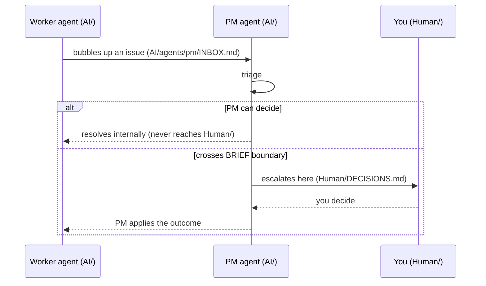

<!--
  HUMAN · DECISIONS · Escalations only · The human decides here
  Location:  Human/ — the only folder a human needs to open.
  Flow:      worker → PM (../AI/agents/pm/INBOX.md) → PM triages →
             PM escalates HERE only what crosses the BRIEF.md autonomy boundary.
  So:        Everything in this file needs YOU. Internal agent back-and-forth never
             reaches here — the PM absorbs it.
  Fill every {{ placeholder }} and delete guidance comments before use.
-->

# DECISIONS — what needs you

> The PM puts something here only when it cannot decide alone — i.e. the choice
> crosses the autonomy boundary in `./BRIEF.md` (scope/goal change, spend,
> irreversible action, security posture). If this file is empty, the team is running
> and you can just watch `./STATUS.md`.

## How it reaches you

## Legend

- **State:** `awaiting-you` · `answered` · `superseded`
- **Blocking?** whether an agent is parked until you answer.

---

## Awaiting you (newest first)

### D-{{ id }} · {{ short title }}
- **Escalated by PM:** {{ time }} (raised by {{ agent }})
- **Blocking?** {{ yes — {{ who/what }} is parked / no }}
- **The situation (plain language):** {{ what's going on, no jargon }}
- **Why it needs you:** {{ which BRIEF boundary it crosses }}
- **Your options:**
  - **A)** {{ option }} — {{ trade-off }}
  - **B)** {{ option }} — {{ trade-off }}
  - **C)** {{ option }} — {{ trade-off }}
- **PM recommendation:** {{ what the PM suggests and why }}
- **Your decision:** _{{ write A / B / C or free text here }}_

---

## Answered (newest first)

### D-{{ id }} · {{ short title }}
- **You decided:** {{ time }} — {{ decision }}
- **Effect:** {{ what the PM did with it — re-planned, unblocked, updated roadmap }}
