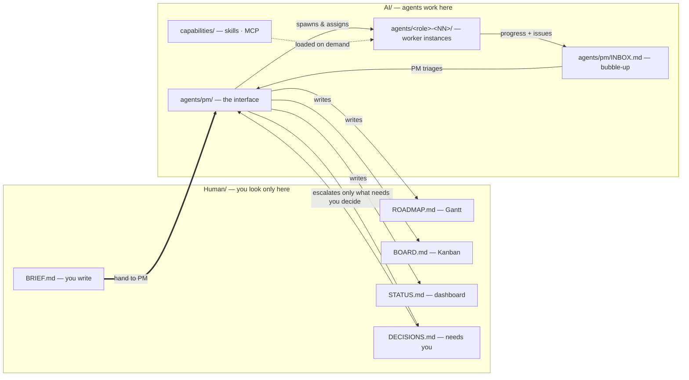

# Agentic Project Planning & Software Development

> A human-directed, agent-executed operating model for planning **and** building.

A mental model — and a set of **reusable markdown templates** — for running a
project where a **human sets the direction and observes**, a permanent
**Project-Manager (PM) agent** turns that direction into a plan and runs the team,
and **worker agents** (possibly many of each role) do the execution and development.

**Scope.** A general **agentic project-planning and software-development** system: one
Human/AI split, PM interface, and bubble-up loop drive the *whole* arc — framing the goal,
decomposing a plan, spawning the right roles, executing them, and closing out — whether the
work is research, design, planning, implementation, or all of them. The built-in cadence
(waterfall once, then iterative + agile loops) adapts to each project.

The whole repository is split down the middle by **who it is for**:

- **`Human/`** — the only folder a human ever needs to open.
- **`AI/`** — the agents' workspace. A human can ignore it entirely.

The PM agent is the bridge: it reads the human's brief, runs the agents in `AI/`, and
keeps `Human/` continuously legible.

---

## The two-folder split



- **You** write `Human/BRIEF.md` and then watch `Human/STATUS.md`, answering
  `Human/DECISIONS.md` on the rare occasions the PM needs you.
- **The PM** (always present, exactly one) lives in `AI/agents/pm/`. It decides the
  team, spawns worker instances, and keeps the four other `Human/` files current.
- **Worker instances** live in `AI/agents/<role>-<NN>/` and do the work.

---

## Repository layout

```
.
├── README.md                       ← this model
│
├── Human/                          ← THE ONLY FOLDER A HUMAN NEEDS
│   ├── README.md                   ← "start here" for the human
│   ├── BRIEF.md                    ← you author: customers · goal · scope · boundary
│   ├── ROADMAP.md                  ← PM writes · Mermaid GANTT (the when)
│   ├── BOARD.md                    ← PM writes · Mermaid KANBAN (what's flowing)
│   ├── STATUS.md                   ← PM writes · dashboard (health · progress)
│   └── DECISIONS.md                ← PM escalates · only what needs you
│
└── AI/                             ← THE AGENT WORKSPACE (humans can ignore)
    ├── README.md                   ← workspace + naming conventions
    ├── capabilities/
    │   ├── SKILL.md · MCP.md
    └── agents/
        ├── pm/                     ← the always-present PM agent
        │   ├── AGENT.md · PLAN.md · TASKS.md
        │   └── INBOX.md            ← worker issues bubble up here
        ├── _role-template/         ← PM copies this per worker INSTANCE
        │   ├── AGENT.md · PLAN.md · TASKS.md
        │   └── runs/_run-template/RUN.md
        └── <role>-<NN>/            ← e.g. developer-01, developer-02, tester-01
            ├── AGENT.md · PLAN.md · TASKS.md
            └── runs/<YYYY-MM-DD>T<HH-MM-SS>/RUN.md   ← dynamic per-session folders
```

---

## Several agents per role — instances

A **role** is a function (developer). An **instance** is one running agent of that
role. A role can have **many instances in parallel**, each in its own folder and each
given a **lane** by the PM so they don't collide:

```
AI/agents/developer-01/     ← write path
AI/agents/developer-02/     ← read path, running at the same time
AI/agents/tester-01/
```

The PM decides how many instances a workload needs, spawns them from
`_role-template/`, and can add or retire instances as the project evolves.

## Autonomous progress — dynamic run folders

Agents work over many **autonomous sessions**. Each session is a **run**, captured in
a dynamic folder named by **date and time**, under the **instance** that did it:

```
AI/agents/developer-01/runs/2026-07-14T10-40-22/RUN.md
AI/agents/developer-01/runs/2026-07-14T14-05-08/RUN.md
AI/agents/developer-02/runs/2026-07-14T11-20-41/RUN.md
```

So the path encodes **agent (role) · instance · date · time** — a complete, ordered,
per-instance history. Runs are append-only; a past run folder is never rewritten.

---

## Bubble-up: issues flow to the PM, not to you

A worker instance **never contacts the human directly**. When it hits the edge of its
autonomy it appends to `AI/agents/pm/INBOX.md`. The PM triages every item and:

- **resolves most itself** (reassign, resequence, unblock, spawn/retire an instance), or
- **escalates to `Human/DECISIONS.md`** only what crosses the `Human/BRIEF.md`
  autonomy boundary (scope/goal change, spend, irreversible action, security posture).

That two-stage filter is what lets you stay a true observer: informed continuously
via `STATUS.md`, interrupted only when a decision is genuinely yours.

## Two registers

- **Agent-facing docs** (all of `AI/`, plus `Human/BRIEF.md`) are terse, structured
  markdown built for machines.
- **Human-facing docs** (`Human/ROADMAP.md`, `BOARD.md`, `STATUS.md`) are enriched —
  a Gantt, a Kanban, a dashboard with health and progress. The PM is the translation
  layer between the two.

## The operating loop (built in, not chosen)

The cadence blends waterfall, iterative and agile: waterfall applies *once* at the top
(you set the brief; the PM sets the plan), then every deliverable — a spec, a design, a
plan, a module, a test suite — **matures iteratively** (draft → reviewed → accepted)
through **agile timeboxed runs** per instance, with monitoring built in via `STATUS.md`.
Planning work and development work run through the *same* loop; the PM reshapes the roadmap
as the project learns. There is no methodology document to pick.

The three roles the loop blends:

- **Plan** — the PM frames the goal, decomposes the roadmap, and (re)assigns work.
- **Do** — worker instances execute their lanes autonomously, run by run.
- **Check** — the PM rolls progress up against the brief; the human observes and steers.

---

## The worked example — `example/`

`example/` is the whole model **filled in** for a small software project: **Snip**, a
URL-shortener REST API. It mirrors the real split — `example/Human/` and `example/AI/`
— and demonstrates every new idea:

- **PM decides the team:** architect ×1, **developer ×2** (parallel write/read lanes),
  tester ×1; deliberately no devops or reviewer. See `example/AI/agents/pm/AGENT.md`.
- **Instances:** `architect-01`, `developer-01`, `developer-02`, `tester-01`.
- **Dynamic run folders:** e.g. `example/AI/agents/developer-01/runs/2026-07-14T10-40-22/RUN.md`.
- **Bubble-up vs escalation:** `example/AI/agents/pm/INBOX.md` shows the PM resolving
  the two-developer split internally and **escalating** the open-redirect question as
  **D-1** to `example/Human/DECISIONS.md`.
- **The human's view:** read `example/Human/STATUS.md` — 🟡 at risk, with D-1 waiting
  on Dana and three cards parked on it in `example/Human/BOARD.md`.

Start by reading `Human/README.md`, then peek at `example/Human/STATUS.md`.

---

## One-line summary

> A human writes **`Human/BRIEF.md`** and watches **`Human/STATUS.md`**; the
> always-present **PM agent** in **`AI/`** turns the brief into the enriched
> **`Human/ROADMAP.md`** (Gantt) and **`Human/BOARD.md`** (Kanban), spawns as many
> **`AI/agents/<role>-<NN>/`** worker instances as the work needs, each logging
> autonomous sessions in **`runs/<date>T<HH-MM-SS>/`**; issues **bubble up** to
> **`AI/agents/pm/INBOX.md`**, and only what truly needs a person is escalated to
> **`Human/DECISIONS.md`**.
