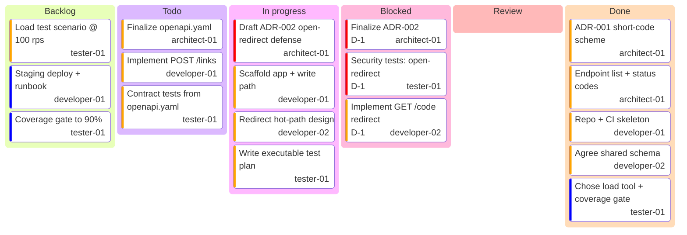

<!-- EXAMPLE (filled) · Planning · BOARD · Owned by the PM agent · Human-facing -->

# BOARD — the live planning board

> Snip's aggregated Kanban, maintained by the PM from each instance's `TASKS.md`.

## Project

- **Project:** Snip — a URL-shortener REST API
- **Maintained by:** `../AI/agents/pm/`
- **Last updated:** 2026-07-14 12:10

## Summary (for the human)

| Column | Count | Notes |
| --- | --- | --- |
| Backlog | 3 | later milestones |
| Todo | 3 | ready to start |
| In progress | 4 | one per active instance |
| Blocked | 3 | ⚠️ all on D-1 — see `./DECISIONS.md` |
| Review | 0 | — |
| Done | 5 | design groundwork + setup |

---

## Kanban

---

## Blocked cards → decisions

| Card | Owner instance | Blocked on | Decision id |
| --- | --- | --- | --- |
| Finalize ADR-002 | architect-01 | which redirect targets are allowed | D-1 |
| Security tests: open-redirect | tester-01 | allow-list definition | D-1 |
| Implement GET /{code} redirect | developer-02 | contract approval (waits on D-1) | D-1 |
