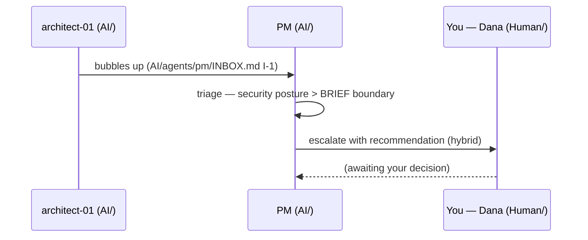

<!-- EXAMPLE (filled) · Human · DECISIONS · escalations only · Dana decides -->

# DECISIONS — what needs you

> Worked example. Only things the PM cannot decide alone land here. Right now there
> is exactly one: **D-1**. Everything else the PM absorbed (see the AI-side
> `../AI/agents/pm/INBOX.md`, which you never have to open).

## How it reached you

## Legend

- **State:** `awaiting-you` · `answered` · `superseded`

---

## Awaiting you (newest first)

### D-1 · Which redirect targets are allowed?
- **Escalated by PM:** 2026-07-14 10:25 (raised by architect-01)
- **Blocking?** yes — 3 cards parked (architect-01 ADR-002, tester-01 security suite,
  developer-02 redirect endpoint)
- **The situation (plain language):** Snip must not become an "open redirect" that
  attackers abuse. We need to decide *which* destination links are allowed.
- **Why it needs you:** this sets the product's security posture — past what the
  agents may decide on their own (your `./BRIEF.md` autonomy boundary).
- **Your options:**
  - **A)** Allow-list of pre-registered campaign domains — safest; needs a list from Marketing.
  - **B)** Deny-list of known-bad + block loops/internal IPs — flexible; higher risk.
  - **C)** Hybrid: any public `https` host, block internal/looping, tighten to A later.
- **PM recommendation:** **C** for launch, move to **A** once Marketing supplies the list.
- **Your decision:** _awaiting Dana — reply A / B / C_

---

## Answered (newest first)

_(none yet)_
