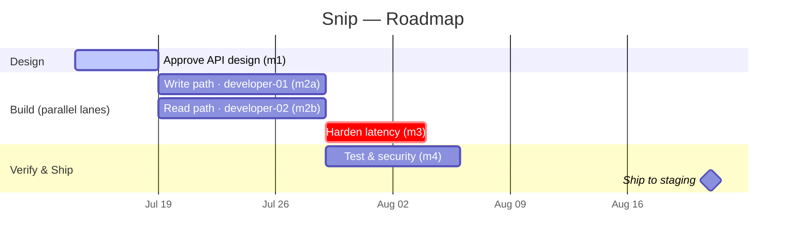

<!-- EXAMPLE (filled) · Planning · ROADMAP · Owned by the PM agent · Human-facing -->

# ROADMAP — the time plan

> Snip's schedule, maintained by the PM for Dana to read at a glance.

## Project

- **Project:** Snip — a URL-shortener REST API
- **Maintained by:** `../AI/agents/pm/`
- **Derived from:** `./BRIEF.md`
- **Last updated:** 2026-07-14

## At a glance (for the human)

> Design is nearly done but paused on one security decision (D-1) that needs your
> call today. Build starts the moment design lands; we're still tracking the 6-week
> window with a little slack.

- **Target ship date:** 2026-08-21  ·  **Confidence:** 🟡 medium
- **Now:** Design (approve API contract)  ·  **Next:** Build core service
- **Top risk:** D-1 (open-redirect policy) blocking design & security tests.

**Legend:** `done` ✅ complete · `active` 🔵 in progress · `crit` 🔴 critical path ·
`milestone` ◆ key date.

---

## Gantt — milestones over time

---

## Agents on this project

| Instance | Role | Owns | Serves brief need |
| --- | --- | --- | --- |
| pm | project manager (always present) | all (oversight) | keep Dana in control |
| architect-01 | architect | m1 — contract + open-redirect safety | fast, safe, standard stack |
| developer-01 | developer | m2a — write path (`POST /links` + persistence) | working software on time |
| developer-02 | developer | m2b — read path (redirect + stats) | working software on time |
| tester-01 | tester | m3, m4 — latency, coverage, security | confidence the goal is met |

## Milestone detail

| # | Milestone | Owner instance | Done when (brief success criterion) |
| --- | --- | --- | --- |
| m1 | Approved API design | architect-01 | Contract + schema + open-redirect ADR reviewed |
| m2a | Write path | developer-01 | create works; persists links |
| m2b | Read path | developer-02 | redirect + stats work end-to-end |
| m3 | Harden latency | developer-02 + tester-01 | p95 < 50 ms @ 100 rps in CI |
| m4 | Test & security | tester-01 | ≥90% coverage; no open redirect |

## Hand-offs

| From | Artifact | To | Accepted when |
| --- | --- | --- | --- |
| architect-01 | Approved `openapi.yaml` + schema | developer-01, developer-02 | Design review passed |
| developer-01 | Shared schema of record | developer-02 | Agreed, no overlap |
| developer-01 / -02 | Built branches + migrations | tester-01 | Builds + smoke test pass |

## Observer check-ins

| Checkpoint | Trigger | Dana reviews |
| --- | --- | --- |
| After m1 | Design done | `./STATUS.md` + contract |
| Before ship | m4 done | Readiness; staging deploy needs her approval |
