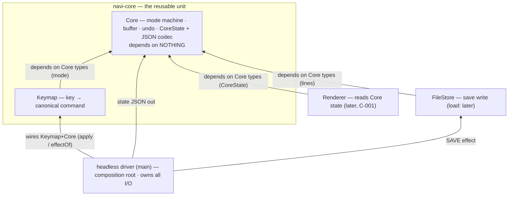

# Architecture: Navi editor v1

## About this document
- **Kind:** `architecture` (internal structure: components, library boundary, dependency rules — V-model stage 3 of 6)
- **Read by:** the downstream V stages — design (W-004: designs the inside of the components defined here), implementation (W-005), and the test stages (test-architecture verifies these boundaries; W-006 drives golden vectors through them); **written by:** the architecture stage worker (role `architect`)
- **Related:** derives from `REQUIREMENTS.md` (stage 1, ticket W-001 — every decision below cites its FR numbers) and `SYSTEM.md` (stage 2, ticket W-002 — parts 1–4, decisions SD-001–SD-007); owning ticket **W-003**. The pinned binding table (REQUIREMENTS.md Appendix A) stays verbatim and closed: this document adds structure, never bindings (C-002, FR-027).

## Chosen Pattern(s)
- **Layered, dependencies pointing inward** — chosen. One pure domain kernel (the navi-core library) with I/O-bearing parts in outer layers around it. Fits because the pinned spec already fixes the seam: a pure `apply` (FR-028) versus the save/quit side effects (FR-025, FR-026) that the driver executes (SD-002). Cost: none of substance at this size.
- **MVC — rejected for v1.** The model/view split *is* our Core/Renderer rule, but view and controller arrive only with the future frontend (C-001); adopting the full pattern now adds roles with no resident parts.
- **Repository — rejected.** FileStore is a write-only save target in v1 (SD-003), not a queryable collection.
- **Event-driven / microservices / SOA / CQRS / P2P — rejected.** One process, one thread, a closed synchronous key→state loop (SYSTEM.md Technology Choices; FR-028).

## Library Boundary
The reusable unit — the **library** in the composition hierarchy — is the **navi-core library** (SYSTEM.md part 1, refined here into two components):

| Library | Responsibility | Depends on |
|---|---|---|
| **navi-core** | The entire closed binding table as logic: **Keymap** + **Core** + the `CoreState` JSON codec. Pure, headless, deterministic. | **nothing** |

Everything else is **application**, not library: the driver, FileStore, and (later) Renderer exist only to give the v1 program I/O and a face. Outside consumers attach at the library boundary: the golden-vector harness (W-006) and any future frontend (C-001), both via `apply`/`effectOf` plus JSON (SD-005, SD-002). In v1's single source file (SD-001, NFR-RUN-001) this is a *logical* boundary inside the file — enforced by the dependency rules below and verified by tests, not by deployment units (the trade-off SYSTEM.md already accepted).

## Components

| Component | Part of | Responsibility (FRs) | Depends on |
|---|---|---|---|
| **Keymap** | navi-core | Translate a logical key event (A-001 names) into one **canonical command** from a closed set, resolving mode scope (I-2): e.g. `x` → DELETE_CHAR in NORMAL but INSERT_CHAR('x') in INSERT; `i` → ENTER_INSERT in NORMAL but INSERT_CHAR('i') in INSERT (AC-006). The command set is the pinned table re-indexed — no more, no fewer (FR-027, C-002). Exact key spelling and command enumeration are design's (W-004). | Core **types** only (the `mode` field, FR-029) |
| **Core** | navi-core | The mode machine (FR-001, FR-014, FR-015), buffer operations (FR-016–FR-021), cursor validity (FR-003), full-state undo (FR-022–FR-024), the `CoreState` shape (FR-029) and its JSON codec (FR-030). Interprets canonical commands; owns no key names. | **nothing** |
| **FileStore** | application (v1) | Execute the SAVE effect's write: `lines` → loaded path as UTF-8/LF with a terminator after the last line (SD-006); no-op when no path (FR-025). **v1 loads nothing** — startup is pinned empty (FR-002) and the closed table has no open binding (FR-027, SD-003); the load half of the name is reserved for later. | Core **types** (`lines`, FR-029) |
| **Renderer** | application (later) | Read Core state (the JSON of FR-030, per SD-005) and paint it. Entirely out of v1 (C-001). Not to be confused with v1's stdout state JSON — that is the driver's observation channel (SD-005), not a renderer. | Core **types** (`CoreState`, FR-029/FR-030) |

The **headless driver** (SYSTEM.md part 2) is the application's composition root, not a fifth component: it reads keys, calls the library façade **`apply(state, key) -> state`** (the pinned signature, FR-028 — the façade composes Keymap+Core inside the library), serializes every state (SD-005), and executes effects: SAVE → FileStore, QUIT → exit (SD-002, FR-025, FR-026). No binding knowledge lives outside navi-core (SD-002); the driver holds the loaded path (I-6, SD-003).

Runtime data flow (one line): `key → Keymap → canonical command → Core → next CoreState + effect → driver → stdout JSON | FileStore write | exit`. All dependency arrows point inward at Core; nothing points at Renderer.

## Dependency Rules
1. **Core depends on nothing.** No other component, no I/O, no threads, no ambient state (FR-028, SD-007).
2. **Keymap depends only on Core's type definitions** (`mode`) — never on Core's logic, FileStore, Renderer, or the driver (FR-027, I-2, FR-029).
3. **Renderer and FileStore depend on Core types** — never on Keymap, on each other, or on the driver (FR-025, FR-029, FR-030).
4. **Nothing depends on Renderer.** It is a terminal consumer (C-001).
5. Only the **driver** sees all parts (composition root) and only it performs I/O (SD-004).

The graph is acyclic by construction: every allowed edge points toward Core.

## The Core Purity Contract (explicit)
- **No I/O** — no stdin/stdout, no files, no network; **not even the save write**: for Ctrl+S the core only yields the (unchanged) state and the SAVE effect — the driver, via FileStore, performs the write (FR-025, FR-028, SD-002).
- **No threads** — single-threaded, synchronous (FR-028; SYSTEM.md Technology Choices).
- **No ambient state** — no clock, no random, no static mutable state, no locale-dependent behavior (SD-007).
- **Deterministic `apply`** — the same `(state, key)` always yields the same next state; total over every key: bound keys transition, unbound keys return the state unchanged (FR-027), effect keys return it unchanged plus their effect (SD-002); the input state object is never mutated (FR-028, AC-017).

Enforced structurally by dependency rules 1–2 and verified behaviorally by the golden vectors of W-006 — the intra-file-boundary trade-off accepted at system level (SD-001).

## Key Quality Attributes
- **QA-001 Determinism & purity** — the editor's defining property (FR-028); supported by Core-depends-on-nothing plus the effect channel keeping side effects out (SD-002).
- **QA-002 Testability** — golden-vector verification without a terminal requires exactly pure `apply` + JSON observation (FR-030, SD-005, FR-028).
- **QA-003 Reusability** — the future frontend (and any other consumer) attaches at the navi-core boundary without modifying it; `CoreState` JSON is the stable contract (C-001, FR-029, FR-030).

## Architecture Decisions
Every decision traces to REQUIREMENTS.md FR numbers (supplementary refs in parentheses).

- **AD-001: Four components — Keymap, Core, FileStore, Renderer** — refine SYSTEM.md parts 1/2/4 so the pure–impure seam becomes explicit components. — FR-028 (the pure core), FR-025/FR-026 (effects live application-side). Trade-off: FileStore and Renderer are thin in v1 (one write; nothing rendered) — kept anyway so I/O never accretes onto the core.
- **AD-002: The reusable library is navi-core** (Keymap + Core + JSON codec); FileStore, Renderer, and the driver are application parts. — FR-028, FR-030 (purity + JSON make the core consumable outside this program). Trade-off: in the one-file v1 the boundary is logical, not physical (SD-001).
- **AD-003: Core consumes canonical commands, never raw keys** — key names stop at Keymap; the mode machine interprets behavior, not spelling. — FR-027 (the closed table lives in one place), FR-004–FR-021 (bindings are behaviors, not strings). Trade-off: one extra translation step.
- **AD-004: Keymap is mode-aware** — `(mode, key) → canonical command`, per I-2: `x` and `i` mean different commands per mode (AC-006), arrows and Ctrl+S/Ctrl+Q map identically in both. — FR-014, FR-016, FR-020, FR-027. Trade-off: mode knowledge sits in two places (Keymap's scope resolution, Core's machine state) — unavoidable, the spec is modal.
- **AD-005: The façade preserves the pinned signature** — `apply(state, key) -> state` composes Keymap+Core inside the library; the effect channel (SD-002) rides the same seam: SAVE/QUIT are canonical commands whose state transition is identity and whose effect the driver executes (`effectOf`). — FR-028, FR-025, FR-026. Trade-off: exact façade and command-enum shapes are design's (W-004).
- **AD-006: Undo is full-state snapshots inside `CoreState`, owned wholly by Core** — no external history component; stack cap included. — FR-022, FR-023, FR-024, FR-029. Trade-off: memory cost of deep snapshots — pinned, accepted.
- **AD-007: FileStore exists in v1 even though v1 only writes** — the SAVE effect must not leak file I/O into ad-hoc driver code nor into Core; loading stays architecturally reserved but unimplemented. — FR-025, FR-002, FR-027 (SD-003). Trade-off: a component with half its name dormant.
- **AD-008: Renderer is named and dependency-isolated from day one but delivers nothing in v1** — stdout JSON is explicitly *not* it. — FR-030 (JSON is the future render input, SD-005; C-001). Trade-off: a placeholder slot — cheaper than retrofitting the boundary later.

### Homes for the design items SYSTEM.md handed forward
Each item SYSTEM.md left open now has an architectural owner; the *exact shape* stays with design (W-004):

| Item (SYSTEM.md) | Architectural home | Pinned by |
|---|---|---|
| Key representation & key-name spelling | Keymap | A-001, FR-027 |
| JSON codec structure | Core (field names fixed) | FR-029, FR-030 |
| Snapshot deep-copy strategy | Core (full-state semantics fixed) | FR-022, FR-023 |
| Harness protocol (vector format, CLI shape) | driver / harness mode (SYSTEM part 3) | SD-005, with W-006 |

## Open Questions
None blocking. All remaining questions are within-component design choices (above), to be settled in DESIGN.md (W-004) — none may alter the components, boundaries, or dependency rules of this document.

## Traceability: components → REQUIREMENTS.md
| Component | FRs realized |
|---|---|
| Keymap | FR-004–FR-015, FR-016–FR-021, FR-025, FR-026, FR-027 (translation of the closed table, mode-scoped per I-2) |
| Core | FR-001–FR-003, FR-014–FR-024, FR-028, FR-029, FR-030 (state machine, buffer, undo, purity, JSON) |
| FileStore | FR-025 (save write; SD-006 format) |
| Renderer | FR-030 (consumes serialized state; future — C-001) |

## Acceptance-criteria map (ticket W-003)
| Ticket AC | Where met |
|---|---|
| 1. ARCHITECTURE.md with About-this-document section | top of this file |
| 2. Components, responsibilities, dependency rules (+ diagram) | Components, Dependency Rules, the mermaid diagram |
| 3. Core purity contract explicit (no I/O, no threads, deterministic apply) | The Core Purity Contract |
| 4. Every architectural decision traces to an FR number | Architecture Decisions AD-001–AD-008; QAs and traceability table |
| 5. Only files under scratch/fleet-regression/editor/ touched | this file is the only work artifact (verified via git status) |
