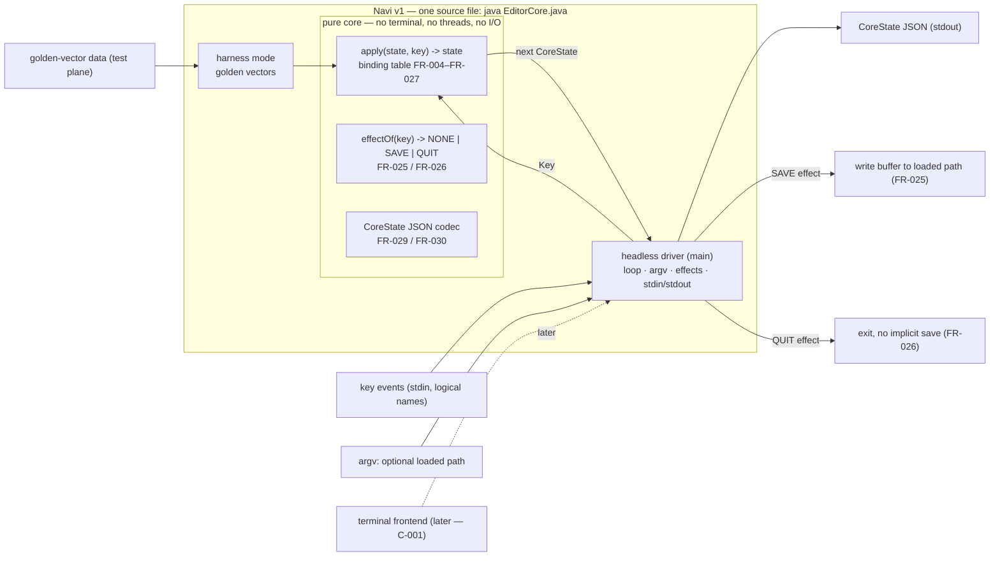

# System: Navi editor v1

## About this document
- **Kind:** `system` (overall system shape — V-model stage 2 of 6)
- **Read by:** the downstream V stages — architecture (W-003), design (W-004), implementation (W-005), and the golden-vector test stage (W-006, the V tip); **written by:** the system stage worker (role `architect`)
- **Related:** derives from `REQUIREMENTS.md` (stage 1, ticket W-001) — every decision below cites its FR/NFR numbers — and resolves that document's open questions **Q-001** and **Q-002**. Owning ticket **W-002**. The pinned spec (REQUIREMENTS.md Appendix A) stays verbatim and closed: this document shapes the system *around* it and adds no bindings (C-002, FR-027).

## Overview
Navi v1 is a modal text editor defined by a closed binding table, delivered as **one self-contained Java 21 source file** launched by plain `java <file>.java` with no build step (NFR-RUN-001). Its heart is a **pure, headless core**: the total function `apply(state, key) -> state` over the JSON-serializable `CoreState` (FR-028, FR-029, FR-030), owning the entire binding table (FR-004–FR-027). Around the core sits a **thin headless driver** — the file's `main` — which owns every side effect: it feeds logical key events in (A-001), emits `CoreState` JSON out, and executes the two effect-bearing bindings, save and quit (FR-025, FR-026). The interactive **terminal frontend is out of scope for v1** (C-001); it will later attach at the same core boundary. Purity (FR-028) plus JSON states (FR-030) make the whole editor **golden-vector testable without a terminal**.

## Major Parts

1. **Navi core — the pure state machine.** `apply(CoreState, Key) -> CoreState` (FR-028), the pure effect mapping `effectOf` (SD-002), and the JSON codec (FR-030). It owns the whole closed binding table (FR-004–FR-027). **The core has NO terminal, NO threads, no clock/random/static mutable state, and NO I/O of any kind** — not even the save write: for Ctrl+S the core only computes the (unchanged) next state and declares the SAVE effect; the driver performs the write (FR-025, FR-028). The same `(state, key)` always yields the same JSON state (SD-007).
2. **Headless driver — the I/O shell.** The same file's `main`: parses argv (loaded path, SD-003), reads logical key events, calls the core, prints state JSON (SD-005), and executes effects — SAVE writes the buffer to the loaded path (no path → no-op), QUIT stops the loop (FR-025, FR-026). Single-threaded, synchronous.
3. **Harness mode — the verification face.** A mode of the same entry point that replays golden-vector data — `(state, key, expected state)` — through the core and reports PASS/FAIL. It is the door the V's right side drives (W-006). Because JDK 21's single-file launch cannot compile a second source file (SD-001), verification enters as **data** (vector files) or as a **subprocess** driving the stdin/stdout interfaces below — either way with no build step. Vector files are test-plane I/O, not editor runtime I/O.
4. **Terminal frontend — future, out of scope v1.** Raw-mode terminal input, escape-sequence decoding into the logical key names of A-001, and screen rendering. It will consume the same `apply`/`effectOf` boundary and adds no bindings (C-001, FR-027).

## Technology Choices
| Concern | Choice | Why (refs) |
|---|---|---|
| Language / runtime | Java 21 (JDK 21), language level 21 | pinned NFR-TECH-001, C-003 |
| Dependencies | **none** — JDK standard library only; JSON via a minimal in-file codec for the `CoreState` grammar | NFR-DEP-001, FR-030 |
| Packaging / launch | single-file-source: `java EditorCore.java [path]` — no build, no classpath (file naming finalized at design stage) | NFR-RUN-001; forces the one-file shape (SD-001) |
| Persistence | none — state lives in memory only; JSON is the observation format, not storage | FR-029, FR-030; smallest viable shape |
| File I/O | the loaded path only, write-only: UTF-8, LF, terminator after the last line too | FR-025, I-6, SD-006 |
| Concurrency | single-threaded, synchronous | FR-028 determinism; core purity |
| Terminal | none in v1; keys are logical names on stdin | C-001, A-001 |

## External Interfaces
- **Key events (in, stdin):** logical key names only — Left/Right/Up/Down, Home/End, Ctrl+Home/Ctrl+End, PageUp/PageDown, Insert, Delete, Backspace, Enter, Esc, Ctrl+S, Ctrl+Q, `i`/`x`/`d`/`u`, printable characters (A-001). v1 decodes **no** terminal escape sequences; the exact wire spelling of key names is decided at design stage (W-004).
- **CoreState JSON (out, stdout):** every state serialized with exactly the pinned field names, mode as `"NORMAL"`/`"INSERT"` (FR-030) — the golden-vector observation channel, the future frontend's render input, and the subprocess boundary a standalone test program can drive.
- **Loaded path (in, argv):** zero or one path — the save target, held by the driver outside `CoreState` (I-6). Nothing is ever loaded from it (FR-002, FR-027 — see SD-003).
- **Buffer write (out, file):** on SAVE with a loaded path, the driver writes `lines` as UTF-8/LF text (FR-025, SD-006); without a path, nothing happens (FR-025).
- **Process exit (out):** QUIT ends the loop and exits without implicit saving (FR-026).
- **Golden-vector files (test plane, in/out):** vector data under `scratch/fleet-regression/editor/` replayed by the harness mode (part 3).

## System Decisions
| # | Decision | Basis |
|---|---|---|
| SD-001 | **One self-contained source file** holds core + driver + harness mode. JDK 21 single-file launch (JEP 330) compiles only the launched file — a second source file would need a build step and break the pinned launch (multi-file source launch arrives only in JDK 22, JEP 458). Purity therefore sits *inside* the file as an explicit boundary (SD-002), verified by golden vectors rather than by deployment units. | NFR-RUN-001, NFR-DEP-001 |
| SD-002 | **Effect channel — resolves Q-001.** `apply` stays pure and total over *all* keys: for Ctrl+S and Ctrl+Q it returns the state unchanged (saving "SHALL NOT change the `CoreState`"; quitting leaves the buffer unmodified), so the entire closed binding table — including the effect keys — lives in one pure place and stays golden-vector testable. Side-effect *intent* is a second pure total mapping in the same core: `effectOf(key) -> {NONE, SAVE, QUIT}` (Ctrl+S→SAVE, Ctrl+Q→QUIT, everything else→NONE; both modes per I-2). The **driver** executes effects: SAVE → write the current `lines` to the loaded path, or no-op when none; QUIT → exit. Result: no binding knowledge outside the core, and no I/O inside the core. A state-field flag was never an option — the `CoreState` shape is pinned with no room for one (FR-029), which is exactly why Q-001 was deferred here. | FR-025, FR-026, FR-027, FR-028, FR-029, I-2, Q-001 |
| SD-003 | **Loaded path via argv — resolves Q-002.** `java EditorCore.java [path]`; no argument → no loaded path → Ctrl+S is a no-op (FR-025). The path is a *save target only*: v1 loads no file content (FR-002 pins empty-buffer startup unconditionally, and the closed table has no open binding — FR-027) and the path cannot change at runtime (no such binding). Held by the driver, outside `CoreState` (I-6). | FR-002, FR-025, FR-027, I-6, Q-002 |
| SD-004 | **Headless in/out only.** v1's sole inputs are the argv path and the stdin key-event stream; its sole outputs are state JSON on stdout, the loaded-path write, and process exit. No terminal control, no network, no config or temp files. | C-001, A-001, FR-025, FR-026 |
| SD-005 | **State observation = JSON.** Every intermediate state serializes with exactly the pinned field names (FR-030); determinism (FR-028) + JSON = golden vectors and the future frontend's render input. | FR-028, FR-030 |
| SD-006 | **Save format.** UTF-8, LF line terminators, one terminator after the last line as well — a buffer of N lines writes N lines and reads back unchanged. | FR-025 |
| SD-007 | **No ambient state in the core.** No clock, random, static mutable state, or locale-dependent behavior — the same `(state, key)` always yields the same JSON. | FR-028 |

## Key Trade-offs / Open Questions
- **Accepted:** core purity is an intra-file boundary, not a deployment boundary (SD-001) — mitigated by golden vectors, which would fail if `apply` touched anything outside its inputs.
- **Accepted:** save overwrites the loaded path without ever loading it (SD-003) — that is the pinned semantics (only Ctrl+S and the loaded path are bound); changing it is a product-owner spec change, not an implementation freedom (C-002).
- **Accepted:** undo keeps full-state deep snapshots (memory cost) — pinned (FR-023, FR-024).
- **Open → architecture (W-003):** internal layout of the single file — the `Key` representation and exact key-name spelling, the JSON codec structure, the snapshot deep-copy strategy, and the harness protocol (vector file format, CLI shape). None of these may alter the parts, boundaries, or decisions above.
- **Non-goal (v1):** raw terminal mode, rendering, colors, mouse — frontend territory (C-001).

## Requirement → system-part traceability
| REQUIREMENTS.md concern | Realized by |
|---|---|
| FR-028, FR-029, FR-030 — pure core, state shape, JSON | Part 1 (pure core); SD-005, SD-007 |
| FR-004–FR-027 — the closed binding table | Part 1 — `apply` + `effectOf` (SD-002) |
| FR-025, FR-026 — save & quit | Part 2 (driver executes effects); SD-002, SD-003, SD-006 |
| FR-002 — empty startup regardless of path | SD-003 |
| NFR-TECH-001, NFR-DEP-001, NFR-RUN-001 — Java 21, no deps, single-file launch | Technology choices; SD-001 |
| C-001, A-001 — frontend deferred; logical key events | Part 4 (future frontend); SD-004 |
| Q-001, Q-002 — open questions from requirements | Resolved: SD-002, SD-003 |
